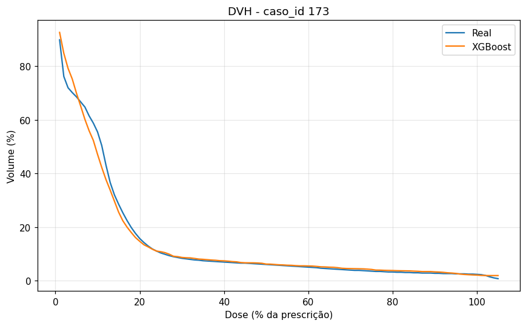
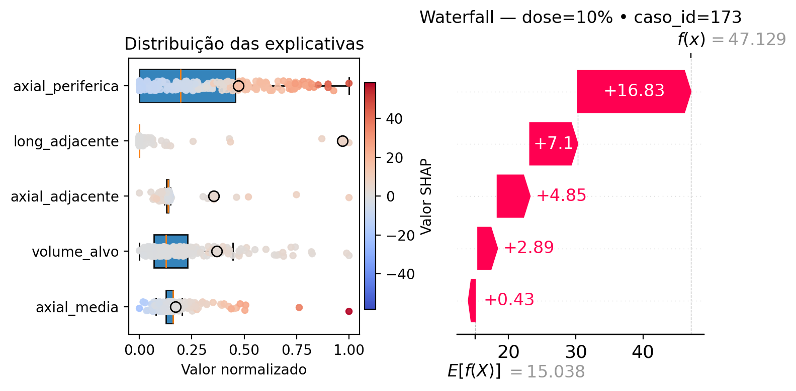

# Aplicação de machine learning explicável para predição de dose em órgãos adjacentes na radioterapia pulmonar

Este repositório reúne os códigos desenvolvidos no Trabalho de Conclusão de Curso em Data Science e Analytics voltado à predição de curvas DVH (*Dose-Volume Histogram*) de órgãos adjacentes ao tumor em radioterapia pulmonar com técnica SBRT/VMAT.

O projeto foi estruturado em três módulos complementares:

- `doseprofiles`: extração, a partir do sistema de planejamento Eclipse, de perfis de dose utilizados na definição qualitativa dos intervalos dos DTHs;
- `dataextractor`: extração, a partir do sistema de planejamento Eclipse, de variáveis geométricas e dosimétricas dos casos selecionados;
- `dvhprediction`: pipeline de modelagem preditiva em Python com análise fatorial, XGBoost e SHAP.

## Objetivo

Desenvolver um pipeline de machine learning explicável para estimar curvas DVH de órgãos adjacentes ao alvo em pacientes submetidos à radioterapia pulmonar, sintetizando a relação espacial entre alvo e órgãos e acrescentando transparência às predições do modelo.

## Estrutura do repositório

```text
tcc-dvh-prediction/
├── README.md
├── CITATION.cff
├── .gitignore
├── requirements.txt
├── results/
│   └── figures/
│       ├── corr_dthin_arvore_bronquica.png
│       ├── corr_dthout_arvore_bronquica.png
│       ├── loadings_dthin_arvore_bronquica.png
│       ├── loadings_dthout_arvore_bronquica.png
│       ├── dvh_caso_173.png
│       └── shap_caso_173_dose_10.png
├── doseprofiles/
├── dataextractor/
└── dvhprediction/
    ├── inputs/
    └── outputs/
```

## Visão geral dos módulos

### `doseprofiles`

Aplicação em C# com ESAPI para extração de perfis de dose axial e longitudinal a partir da borda do alvo. Esses perfis foram utilizados como referência qualitativa para definição dos intervalos adotados na discretização dos histogramas DTH.

### `dataextractor`

Aplicação em C# com ESAPI para extração automática das variáveis do estudo, incluindo:

- volume do alvo;
- histogramas DTH-In e DTH-Out;
- pontos da curva DVH cumulativa.

As saídas são organizadas em arquivos CSV estruturados para uso posterior na modelagem.

### `dvhprediction`

Pipeline em Python para:

- estatística descritiva;
- análise de correlação;
- redução de dimensionalidade por análise fatorial;
- normalização das variáveis;
- treinamento com XGBoost;
- validação cruzada por grupo;
- avaliação global e por faixa de dose;
- comparação entre DVHs reais e preditas;
- interpretabilidade local com SHAP.

## Metodologia resumida

O pipeline foi desenvolvido para dados de pacientes tratados com SBRT pulmonar com técnica VMAT.

As variáveis explicativas iniciais incluem descritores baseados em *Distance-to-Target Histogram* (DTH), subdividido em duas componentes:

- **DTH-In**: fração do órgão presente nos mesmos planos axiais do alvo;
- **DTH-Out**: fração do órgão presente em planos axiais que não contêm o alvo.

As variáveis DTH foram submetidas à redução de dimensionalidade por análise fatorial. Os constructos obtidos foram combinados ao volume do alvo e à variável `dose_perc`, compondo a entrada do modelo de regressão com XGBoost. A interpretabilidade das estimativas foi analisada com SHAP.

## Base de dados e escopo do estudo

O estudo foi conduzido com dados retrospectivos de pacientes tratados com SBRT pulmonar, técnica VMAT.

Foram analisados quatro órgãos adjacentes ao alvo:

- árvore brônquica;
- coração;
- esôfago;
- medula espinhal.

## Fluxo geral do projeto

De forma resumida, o projeto seguiu as etapas abaixo:

1. extração de perfis médios de dose em C# via ESAPI;
2. definição qualitativa dos intervalos dos DTHs;
3. extração automática das variáveis geométricas e dosimétricas;
4. organização dos dados em arquivos CSV;
5. separação treino-teste por caso;
6. redução de dimensionalidade por análise fatorial;
7. normalização das variáveis explicativas;
8. treinamento e ajuste do modelo XGBoost;
9. avaliação global e estratificada por faixa de dose;
10. análise de interpretabilidade local com SHAP.

## Resultados e discussão

As figuras a seguir apresentam resultados representativos para a **árvore brônquica**, utilizada como exemplo visual do comportamento observado no estudo.

### Correlação e redução de dimensionalidade

As variáveis dos histogramas **DTH-In** e **DTH-Out** apresentaram correlações positivas elevadas entre faixas de distância próximas, indicando redundância de informação e justificando o uso de **análise fatorial** como etapa de redução de dimensionalidade, como ilustrado nas **Figuras 1** e **2**.

<p align="center">
  
  
</p>

<p align="center">
  <em>Figura 1. Matriz de correlação DTH-In para a árvore brônquica. &nbsp;&nbsp; Figura 2. Matriz de correlação DTH-Out para a árvore brônquica.</em>
</p>

A análise fatorial mostrou adequação para os dados (**Bartlett p &lt; 0,001** em todos os órgãos). Para o **DTH-In**, foram retidos **três fatores** com rotação varimax, interpretados como **axial_adjacente**, **axial_media** e **axial_periferica**. Para o **DTH-Out**, foi retido **um fator**, interpretado como **long_adjacente**. A estrutura das cargas fatoriais, apresentada nas **Figuras 3** e **4**, sustenta essa interpretação espacial dos constructos.

<p align="center">
  
  
</p>

<p align="center">
  <em>Figura 3. Cargas fatoriais do DTH-In para a árvore brônquica. &nbsp;&nbsp; Figura 4. Cargas fatoriais do DTH-Out para a árvore brônquica.</em>
</p>

Esses resultados indicam que a estrutura original dos DTHs pôde ser representada de forma mais compacta e interpretável, com pequena perda de informação.

### Desempenho preditivo do modelo

O modelo baseado em **XGBoost** apresentou desempenho consistente para os quatro órgãos avaliados, com boa estabilidade entre conjunto de teste e validação cruzada.

| Órgão | R² (teste) | MAE | RMSE | R² CV (média ± DP) |
|---|---:|---:|---:|---:|
| Árvore brônquica | 0.954 | 0.922 | 2.899 | 0.937 ± 0.020 |
| Coração | 0.937 | 0.343 | 1.612 | 0.958 ± 0.011 |
| Esôfago | 0.942 | 0.528 | 1.661 | 0.931 ± 0.009 |
| Medula espinhal | 0.941 | 0.361 | 1.362 | 0.920 ± 0.030 |

Na análise estratificada por faixa de dose, os maiores erros ocorreram em **0–20% da dose**, com **MAE entre 1.602 e 3.992** e **RMSE entre 3.162 e 6.603**. A partir de 20%, houve redução progressiva do erro, em linha com a menor variabilidade da resposta nas regiões de dose mais alta.

A comparação entre curvas **DVH reais e preditas** mostrou boa concordância global, como exemplificado na **Figura 5** para o caso 173 do conjunto de teste.

<p align="center">
  
</p>

<p align="center">
  <em>Figura 5. Comparação entre DVH real e predito para o caso 173 do conjunto de teste.</em>
</p>

De forma pontual, observaram-se pequenas inconsistências locais, como discretas violações de monotonicidade e valores ligeiramente negativos, sem comprometer a tendência geral das curvas.

### Explicabilidade do modelo

A análise com **SHAP** reforçou a coerência física das predições. Na **Figura 6**, referente ao caso 173 no nível de dose de 10%, a predição é decomposta em contribuições individuais das variáveis explicativas, a partir do valor médio esperado do modelo até o valor final estimado.

<p align="center">
  
</p>

<p align="center">
  <em>Figura 6. Explicabilidade local com SHAP para o caso 173 na dose de 10% À esquerda, o gráfico de distribuição normalizada que situa os valores das variáveis explicativas do caso (círculo preto) em relação à base de treino, com coloração correspondente aos valores SHAP no nível de dose analisado (10%). À direita, o gráfico waterfall decompõe a predição a partir do valor médio esperado do modelo para o nível de dose de 10%, E[f(X)] = 15,038, até o valor estimado, f(X) = 47,129.</em>
</p>

Ao longo das curvas DVH, observou-se uma transição no padrão explicativo: em **baixas doses**, a predição tende a ser mais influenciada por **axial_periferica** e **axial_media**; em **doses mais altas**, a contribuição se concentra progressivamente em **axial_adjacente**, refletindo a maior importância da proximidade imediata entre órgão e alvo. Em casos específicos, a variável **long_adjacente** também pode assumir papel relevante, indicando influência da relação espacial na região *out-of-field*.

### Discussão breve

Em conjunto, os resultados indicam que a combinação de descritores geométricos baseados em **DTH**, redução de dimensionalidade por **análise fatorial**, modelagem com **XGBoost** e interpretação por **SHAP** constitui uma abordagem eficaz e interpretável para predição de **DVH** em radioterapia pulmonar. Além do bom desempenho preditivo, o modelo mostrou comportamento compatível com a lógica espacial da distribuição de dose, o que reforça seu potencial de apoio ao planejamento e à avaliação radioterápica.

## Dados disponibilizados

Devido a restrições institucionais e éticas, os dados utilizados neste estudo — incluindo DVHs, DTHs e variáveis derivadas — não podem ser disponibilizados publicamente.

## Tecnologias utilizadas

### `doseprofiles` e `dataextractor`

- C#
- .NET Framework 4.6.2
- Varian Eclipse
- ESAPI 16.1

### `dvhprediction`

- Python 3
- NumPy
- pandas
- matplotlib
- seaborn
- scikit-learn
- XGBoost
- SHAP
- factor-analyzer
- joblib

## Instalação do ambiente Python

```bash
pip install -r requirements.txt
```

## Execução

A execução do pipeline preditivo é realizada no módulo `dvhprediction`, utilizando os arquivos de entrada que devem estar na pasta `inputs/`.

Exemplo:

```bash
python dvh_prediction.py
```

> Observação: os módulos `doseprofiles` e `dataextractor` dependem de ambiente institucional autorizado, com acesso ao Eclipse/ESAPI.

## Saídas do pipeline

O pipeline em Python foi desenvolvido para gerar, entre outros artefatos:

- métricas globais de desempenho;
- métricas por faixa de dose;
- modelos ajustados;
- escalonador;
- objetos da análise fatorial;
- metadados da execução;
- gráficos de comparação entre DVHs reais e preditas;
- gráficos de interpretabilidade com SHAP.

## Uso e citação

Este repositório é disponibilizado publicamente para fins acadêmicos e apresentação metodológica.

Se você for referenciar este material, utilize as informações disponíveis em `CITATION.cff`.

Nenhuma licença open source está sendo concedida neste momento para reutilização, modificação ou redistribuição do código.

## Autor

**Anselmo Mancini**

Universidade de São Paulo – USP/ESALQ
